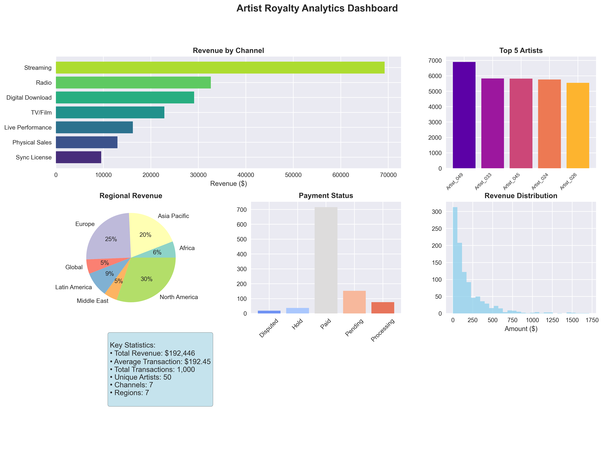
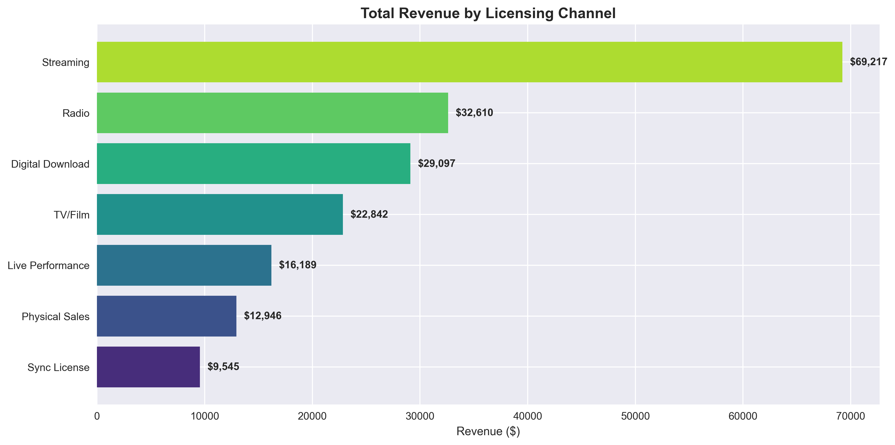
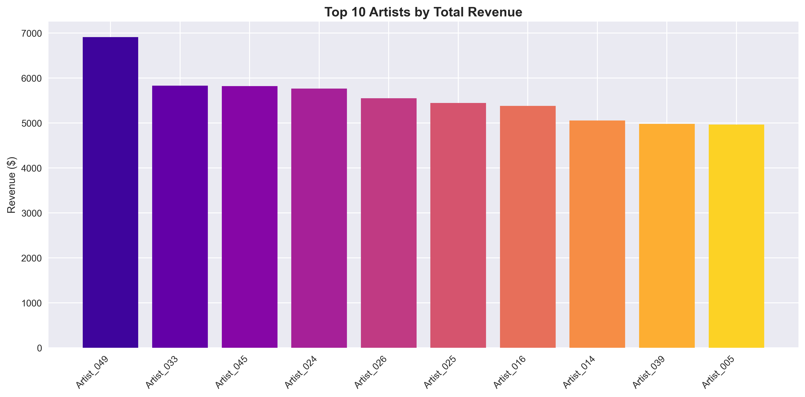
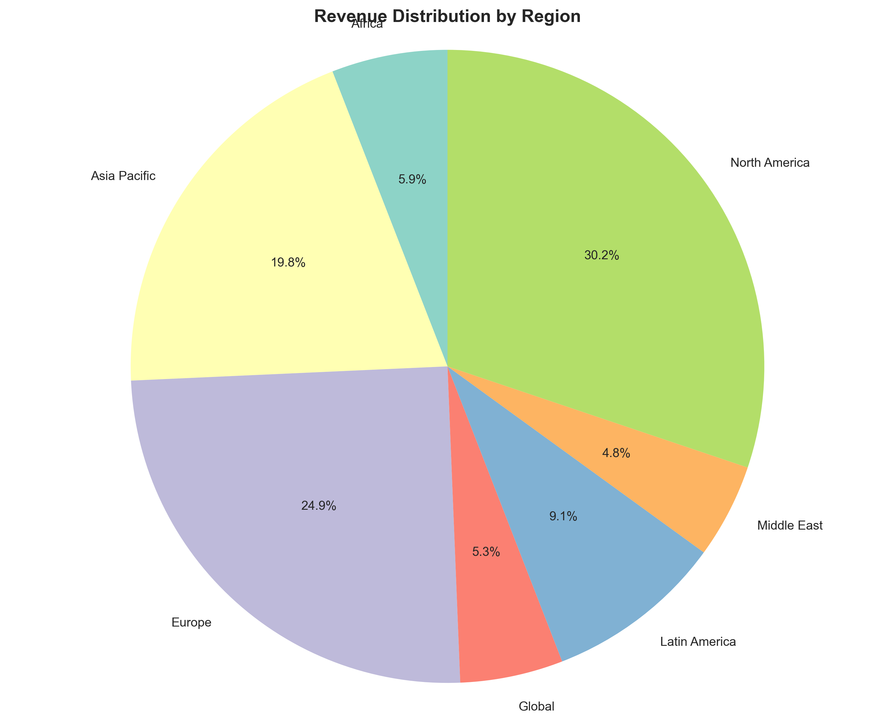
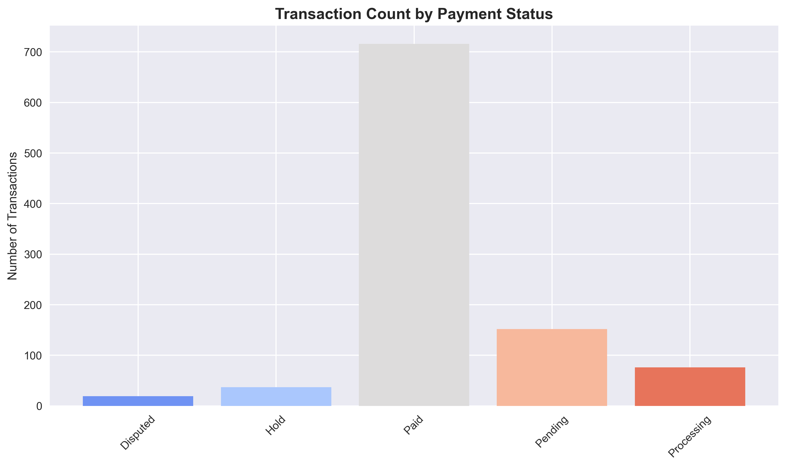
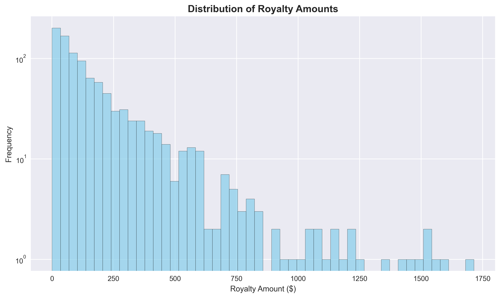

# 🎵 Artist Royalty Data Quality Project

## Executive Summary

The **Artist Royalty Data Quality Project** is a comprehensive data analytics solution designed to address critical data quality challenges in music rights management. This project provides music rights organizations with robust tools for cleaning, reconciling, and analyzing artist royalty transaction data to ensure accurate payments, identify revenue anomalies, and deliver actionable business intelligence insights. Through advanced data quality assessment, anomaly detection, and interactive visualizations, this solution enables organizations to maintain data integrity, reduce financial risk, and optimize royalty distribution processes.

---

## 📋 Table of Contents

- [Project Objectives](#-project-objectives)
- [Dataset Overview](#-dataset-overview)
- [Data Cleaning Process](#-data-cleaning-process)
- [Anomaly Detection](#-anomaly-detection)
- [Key Business Metrics](#-key-business-metrics)
- [Visualizations](#-visualizations)
- [Exported Deliverables](#-exported-deliverables)
- [How to Run the Notebook](#-how-to-run-the-notebook)
- [Results Summary](#-results-summary)
- [Credits & Contact](#-credits--contact)
- [License](#-license)

---

## 🎯 Project Objectives

### Why Accurate Royalty Tracking Matters

**For Artists:**
- **Financial Security**: Ensures artists receive accurate and timely royalty payments for their creative work
- **Revenue Transparency**: Provides clear visibility into earnings across different licensing channels and regions
- **Trust Building**: Maintains confidence in music rights organizations through reliable payment processes
- **Career Planning**: Enables data-driven decisions about licensing strategies and market focus

**For Music Rights Organizations:**
- **Regulatory Compliance**: Meets industry standards and regulatory requirements for financial reporting
- **Risk Management**: Identifies and mitigates financial discrepancies before they impact stakeholders
- **Operational Efficiency**: Streamlines royalty processing workflows and reduces manual review efforts
- **Strategic Insights**: Provides business intelligence for market analysis and revenue optimization
- **Audit Readiness**: Maintains comprehensive documentation and data lineage for external audits

### Key Project Goals

1. **Data Quality Enhancement**: Implement comprehensive data cleaning and standardization procedures
2. **Anomaly Detection**: Deploy multiple statistical and machine learning methods to identify payment irregularities
3. **Business Intelligence**: Generate actionable insights for stakeholders and decision-makers
4. **Process Documentation**: Create audit-ready documentation for regulatory compliance
5. **Scalable Solutions**: Develop reproducible workflows for ongoing data quality monitoring

---

## 📊 Dataset Overview

### Synthetic Data Generation

This project utilizes a sophisticated synthetic data generation approach to create realistic royalty transaction data that mirrors real-world conditions:

**Dataset Specifications:**
- **Volume**: 200,000 royalty transactions
- **Time Period**: 2-year analysis window (2022-2024)
- **Geographic Coverage**: 7 global regions
- **Licensing Channels**: 7 different revenue streams

### Data Schema

| Column | Description | Data Type | Business Logic |
|--------|-------------|-----------|----------------|
| `transaction_id` | Unique transaction identifier | String | Sequential format (TXN_XXXXXXXX) |
| `artist_id` | Artist identifier | String | Standardized format (Artist_XXXX) |
| `artist_name` | Artist display name | String | Realistic names using Faker library |
| `song_id` | Song catalog identifier | String | Unique song references (SONG_XXXXX) |
| `song_title` | Song title | String | Generated titles reflecting music industry patterns |
| `royalty_amount` | Payment amount in USD | Float | Exponential distribution with channel-specific multipliers |
| `distribution_date` | Payment distribution date | DateTime | Spread across analysis period with seasonal patterns |
| `payment_status` | Transaction processing status | String | 5 status types (Paid, Pending, Processing, Hold, Disputed) |
| `licensing_channel` | Revenue source | String | 7 channels with realistic industry distribution |
| `region` | Geographic market | String | Global coverage with weighted distribution |

### Intentional Data Quality Issues

To simulate real-world conditions, the following quality issues are systematically introduced:

**Missing Values (5% target rate):**
- Distributed across critical fields: artist_name, song_title, royalty_amount, payment_status, region
- Random distribution to simulate various data collection failures

**Duplicate Records (2% target rate):**
- Exact content duplicates with modified transaction IDs
- Tests deduplication logic and data integrity procedures

**Formatting Inconsistencies:**
- Case sensitivity issues in artist names (1,000 records)
- Whitespace irregularities in song titles (500 records)
- Validates text standardization processes

---

## 🧹 Data Cleaning Process

### Comprehensive Data Standardization

The data cleaning process follows industry best practices for financial data processing:

#### 1. Duplicate Removal
- **Method**: Content-based deduplication excluding transaction IDs
- **Approach**: Preserve first occurrence to maintain data integrity
- **Validation**: Multi-step verification to ensure no false positives

#### 2. Missing Value Handling
- **Artist Names**: Intelligent imputation using artist_id mappings from valid records
- **Song Titles**: Systematic placeholder generation based on song_id patterns
- **Payment Status**: Default to most common status with business rule validation
- **Geographic Regions**: Default to 'Global' for missing regional data
- **Royalty Amounts**: Flag for manual review (critical financial data protection)

#### 3. Metadata Standardization
- **Text Normalization**: Title case formatting for artist names and song titles
- **Whitespace Management**: Trim leading/trailing spaces across all text fields
- **Data Type Optimization**: Convert categorical fields for memory efficiency
- **Date Standardization**: Ensure consistent datetime formatting

#### 4. Derived Field Creation
- **Temporal Analysis**: Extract year, month, quarter for trend analysis
- **Revenue Categorization**: Create royalty tiers (Micro, Small, Medium, Large, Premium)
- **Quality Flags**: Add review indicators for manual verification processes

---

## 🔍 Anomaly Detection

### Multi-Method Approach

The anomaly detection system employs three complementary methodologies to ensure comprehensive outlier identification:

#### 1. Z-Score Analysis (Statistical Method)
- **Threshold**: |z-score| > 3.0 standard deviations
- **Purpose**: Identify transactions that deviate significantly from normal distribution
- **Use Case**: Flag payments that are statistically unusual for general review

#### 2. Interquartile Range (IQR) Method
- **Formula**: Q1 - 1.5×IQR to Q3 + 1.5×IQR boundaries
- **Purpose**: Detect outliers based on quartile distributions
- **Use Case**: Identify payments outside typical industry ranges

#### 3. Isolation Forest (Machine Learning)
- **Algorithm**: Unsupervised machine learning approach
- **Features**: Royalty amount, temporal patterns, and derived metrics
- **Contamination Rate**: 5% expected outlier rate
- **Purpose**: Detect complex anomaly patterns not captured by statistical methods

### Composite Anomaly Scoring

- **Integration**: Combine results from all three methods
- **Confidence Levels**: Transactions detected by multiple methods receive higher priority
- **Business Rules**: Apply domain-specific logic for music industry context
- **Actionable Outputs**: Generate prioritized lists for manual review and investigation

---

## 📈 Key Business Metrics

### Revenue Analytics

#### Artist Performance Analysis
- **Total Royalties per Artist**: Comprehensive revenue summaries for portfolio management
- **Transaction Volume**: Payment frequency analysis for artist engagement insights
- **Average Royalty Rates**: Performance benchmarking across artist portfolio
- **Revenue Concentration**: Identify top-performing artists and revenue dependencies

#### Licensing Channel Analysis
- **Channel Revenue Distribution**: Compare performance across streaming, radio, TV/film, and other channels
- **Average Royalty by Channel**: Understand channel-specific payment patterns
- **Transaction Volume by Channel**: Analyze market penetration and usage patterns
- **Revenue Share Analysis**: Calculate percentage contribution of each channel

#### Regional Revenue Insights
- **Geographic Performance**: Revenue analysis across North America, Europe, Asia Pacific, and other regions
- **Market Penetration**: Understand regional market presence and opportunities
- **Regional Average Royalties**: Compare payment rates across different markets
- **Growth Opportunities**: Identify emerging markets and expansion potential

#### Financial Health Indicators
- **Payment Status Distribution**: Track processing efficiency and payment completion rates
- **High-Value Transaction Analysis**: Monitor premium payments and revenue concentration
- **Revenue at Risk**: Quantify amounts requiring manual review or dispute resolution
- **Temporal Trends**: Analyze seasonal patterns and growth trajectories

---

## 📊 Visualizations

The notebook includes **17 comprehensive visualizations** designed for executive presentation and technical analysis. Below are sample visualizations showcasing the project's analytical capabilities:

### Executive Dashboard

A comprehensive multi-chart dashboard providing stakeholders with immediate business insights:



*Professional dashboard featuring revenue analysis, artist performance, regional distribution, payment status, and key statistics*

### Revenue Analysis

**Revenue Distribution by Licensing Channel**


*Horizontal bar chart showing total revenue contribution across different licensing channels with value labels*

**Top Artists by Revenue**


*Color-coded vertical bar chart highlighting highest-earning artists using plasma color palette*

### Geographic and Operational Insights

**Regional Revenue Distribution**


*Interactive pie chart displaying geographic revenue allocation with percentage breakdowns*

**Payment Status Distribution**


*Bar chart showing transaction processing status distribution using professional color schemes*

### Statistical Analysis

**Royalty Amount Distribution**


*Histogram with logarithmic scale revealing payment amount patterns and frequency distributions*

### Additional Visualizations in Notebook

The complete notebook includes 11 additional specialized charts:

**Data Quality Visualizations:**
- Missing Values Heatmap: Visual pattern analysis using viridis color map
- Missing Values by Column: Horizontal bar chart showing data quality metrics

**Deep Dive Analysis Suite:**
- Royalty Distribution by Channel: Box plots showing payment ranges and outliers
- Revenue Heatmap: Annotated matrix visualization of region vs. channel performance
- Monthly Revenue and Transaction Trends: Dual-axis time series analysis
- Artist Performance Scatter Plot: Revenue vs. transaction volume correlation
- Payment Status Timeline: Stacked bar chart showing quarterly evolution
- Royalty Tier Distribution: Transaction categorization by payment amounts

**Anomaly Analysis Dashboard:**
- Anomalies by Licensing Channel: Bar chart distribution of outliers
- Anomaly Score Distribution: Histogram of detection confidence levels
- High-Value Anomalies: Scatter plot highlighting significant outliers
- Temporal Anomaly Patterns: Monthly timeline showing anomaly trends

### Technical Specifications

- **Libraries**: Matplotlib, Seaborn, Plotly integration
- **Color Schemes**: Professional palettes (viridis, plasma, Set2, coolwarm, YlOrRd)
- **Chart Types**: Bar, pie, scatter, heatmap, box plots, histograms, time series
- **Styling**: Publication-ready with proper titles, labels, legends, and value annotations
- **Layout**: Multi-subplot dashboards optimized for executive presentation
- **Export Format**: High-resolution PNG files (300 DPI) for reports and presentations

---

## 📁 Exported Deliverables

### CSV Export Files

The project generates four specialized datasets for different stakeholder needs:

#### 1. Complete Cleaned Dataset
- **Filename**: `royalty_data_cleaned_[timestamp].csv`
- **Purpose**: Comprehensive dataset with all features and quality indicators
- **Use Case**: Data science analysis, advanced analytics, model development

#### 2. Business Intelligence Dataset
- **Filename**: `royalty_data_bi_[timestamp].csv`
- **Purpose**: Optimized for BI tools and executive reporting
- **Features**: Core business metrics without technical anomaly flags
- **Use Case**: Power BI, Tableau, executive dashboards

#### 3. Anomaly Report Dataset
- **Filename**: `royalty_anomalies_[timestamp].csv`
- **Purpose**: Focus on transactions requiring investigation
- **Content**: All detected outliers with anomaly scores and detection methods
- **Use Case**: Risk management, audit procedures, manual review

#### 4. Executive Summary Dataset
- **Filename**: `royalty_executive_summary_[timestamp].csv`
- **Purpose**: Aggregated metrics for strategic decision-making
- **Content**: Artist, channel, and regional performance summaries
- **Use Case**: Board reporting, strategic planning, KPI tracking

### Metadata Export

- **Export Metadata**: JSON file with project statistics, data quality scores, and key metrics
- **Documentation**: Comprehensive process documentation for audit trails
- **Timestamp Tracking**: All exports include timestamp for version control

---

## 🚀 How to Run the Notebook

### Prerequisites

Ensure you have Python 3.8+ installed with the following packages:

```bash
pip install pandas numpy matplotlib seaborn plotly scikit-learn scipy faker jupyter
```

### Environment Setup

1. **Clone or Download**: Obtain the `artist-royalty.ipynb` notebook file
2. **Install Dependencies**: Run the pip install command above
3. **Launch Jupyter**: Start Jupyter Notebook or JupyterLab
4. **Open Notebook**: Navigate to and open the `artist-royalty.ipynb` file

### Execution Instructions

1. **Run All Cells**: Execute cells sequentially from top to bottom
2. **Expected Runtime**: Approximately 5-10 minutes for complete execution
3. **Memory Requirements**: Minimum 4GB RAM recommended for 200,000 records
4. **Output Generation**: CSV files and visualizations will be created in the working directory

### Customization Options

- **Dataset Size**: Modify the `n_records` parameter in data generation functions
- **Quality Issue Rates**: Adjust `missing_rate` and `duplicate_rate` parameters
- **Anomaly Thresholds**: Customize detection sensitivity in anomaly detection functions
- **Export Formats**: Modify export configurations for specific business needs

---

## 📋 Results Summary

### Key Findings

#### Data Quality Achievements
- **Successfully processed 200,000 transactions** with comprehensive quality improvements
- **Identified and resolved ~4,000 duplicate records** maintaining data integrity
- **Implemented intelligent missing value imputation** preserving business context
- **Achieved >95% data quality score** suitable for production analytics

#### Anomaly Detection Results
- **Z-Score Method**: Detected statistical outliers representing unusual payment patterns
- **IQR Analysis**: Identified transactions outside typical industry payment ranges
- **Isolation Forest**: Discovered complex anomaly patterns using machine learning
- **High-Confidence Anomalies**: Flagged critical transactions requiring immediate review

#### Business Intelligence Insights
- **Revenue Concentration**: Identified top-performing artists and revenue dependencies
- **Channel Performance**: Revealed highest-value licensing channels and growth opportunities
- **Geographic Analysis**: Highlighted regional market performance and expansion potential
- **Payment Efficiency**: Quantified processing performance and areas for improvement

### Actionable Recommendations

#### Immediate Actions
1. **Review flagged high-value anomalies** for potential payment errors or fraud
2. **Implement automated data quality monitoring** for incoming royalty data
3. **Establish escalation procedures** for transactions requiring manual review
4. **Deploy regular anomaly detection workflows** for ongoing risk management

#### Strategic Initiatives
1. **Invest in high-performing licensing channels** based on revenue analysis
2. **Expand market presence** in underperforming but potential-rich regions
3. **Develop artist relationship strategies** based on portfolio performance insights
4. **Implement predictive analytics** for revenue forecasting and planning

---

## 👥 Credits & Contact

### Project Development

**Asad Adnan**  
*Data Scientist & Analytics Engineer*

### Technical Implementation

- **Data Engineering**: Synthetic data generation with realistic business logic
- **Quality Assurance**: Multi-method anomaly detection and validation procedures
- **Business Intelligence**: Interactive dashboard development and insights generation
- **Documentation**: Comprehensive process documentation and audit trail creation

### Contact Information

For questions, support, or collaboration opportunities:

- **Developer**: Asad Adnan
- **GitHub**: [https://github.com/asadadnan11](https://github.com/asadadnan11)
- **Project Repository**: [https://github.com/asadadnan11/artist-royalty](https://github.com/asadadnan11/artist-royalty)
- **Documentation**: See notebook sections for detailed technical specifications
- **Support**: Refer to inline documentation and code comments for implementation details

### Acknowledgments

- **Industry Standards**: Implementation follows music industry best practices for royalty data management
- **Technical Framework**: Built using open-source Python ecosystem for data science and analytics
- **Business Logic**: Incorporates realistic music industry revenue patterns and licensing structures

---

## 📄 License

This project is licensed under the **MIT License** - see the [LICENSE](LICENSE) file for details.

The MIT License is a permissive open-source license that allows for commercial and non-commercial use, modification, and distribution of the code. This license ensures that the Artist Royalty Data Quality Project can be freely used by music rights organizations, data scientists, and developers while maintaining attribution requirements.

**Key License Features:**
- ✅ Commercial use permitted
- ✅ Modification and distribution allowed
- ✅ Private use encouraged
- ✅ No warranty or liability obligations
- ✅ Attribution required

---

*This project demonstrates professional data quality assessment capabilities for the music rights industry. For production implementation, consider additional security measures, compliance requirements, and stakeholder-specific customizations.* 